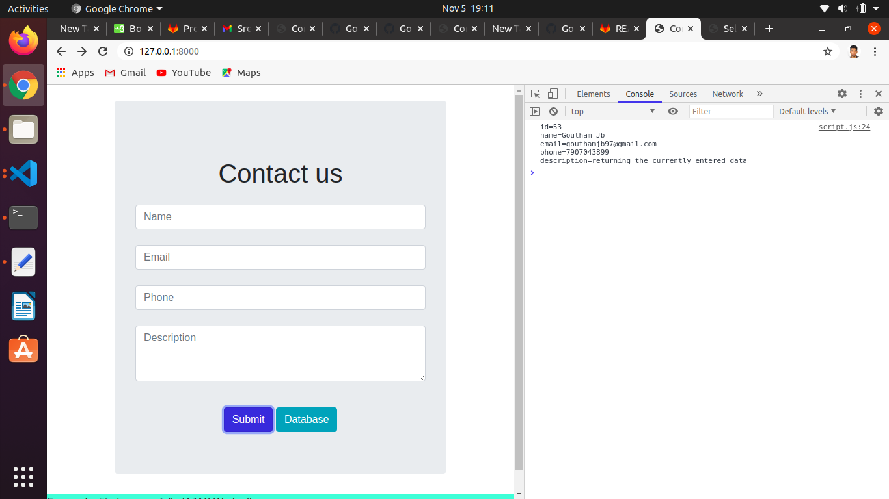
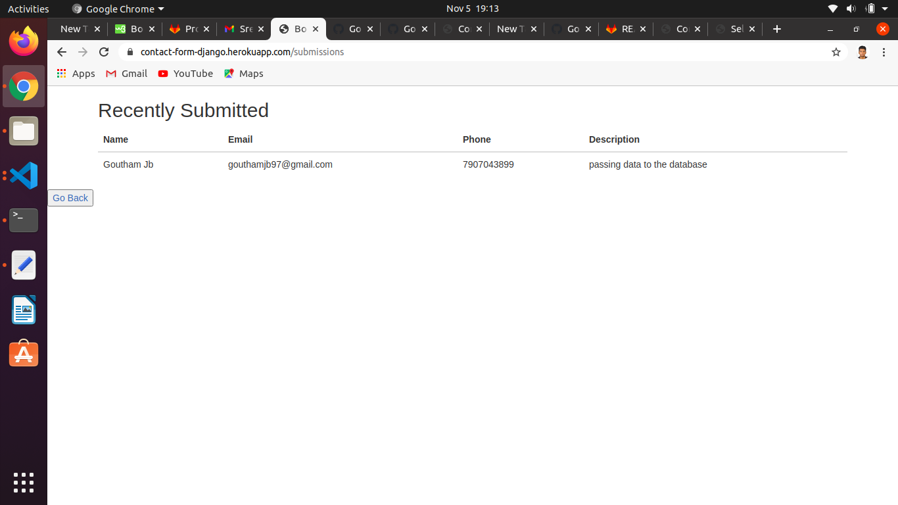
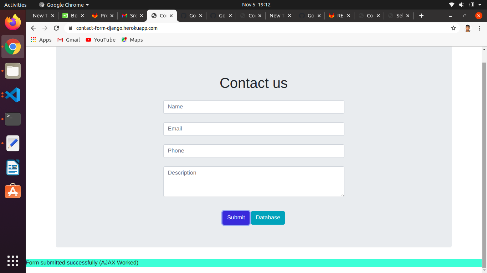
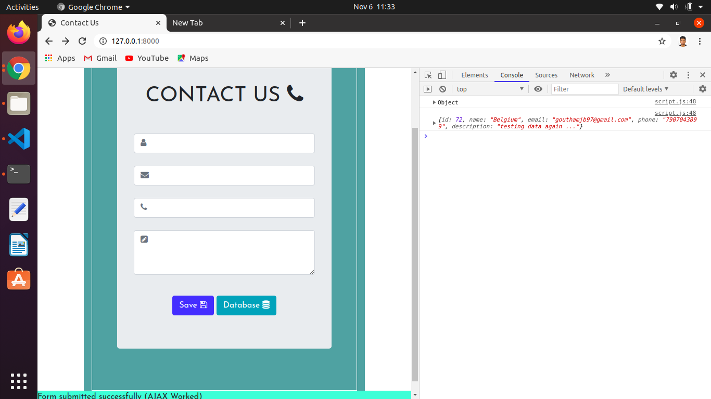

1.created a django project and django app.
2.mentioned the app in project's settings.py.
3.created a model for various fields.
4.included the templates and validated the field using pattern attribute.
5.included the script ,inside the script the ajax concept was added.
6.inside views.py a function was created to render both the html pages based on the request.
7.url mapping was done in urls.py.
8.passed the JSON data to console
9.email was made unique

